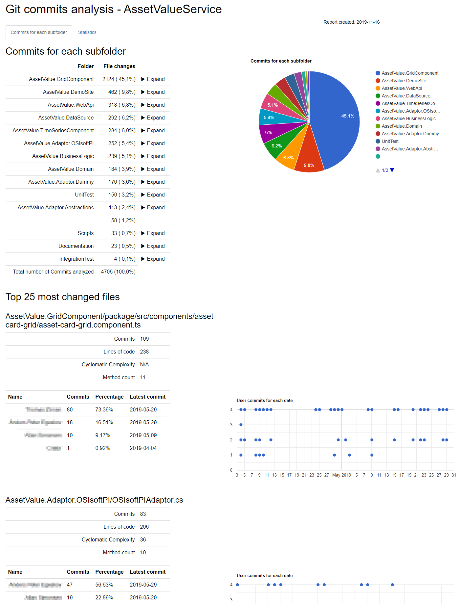

# GitCommitsAnalysis   

This tool can be used to generate a report showing the temporal distribution of you commits and the size and complexity of the codefiles in a Git repository.

## Motivation

The inspiration for this tool is this YouTube video: [Adam Tornhill - Seven Secrets of Maintainable Codebases](https://www.youtube.com/watch?v=a74UkJxKWVM&t=881s).
In the video he shows how to do a temporal analysis of your codebase to determine hotspots and candidates for refactoring.

By combining the number of lines of the code files with the number of commits and the [cyclomatic complexity](https://en.wikipedia.org/wiki/Cyclomatic_complexity), you can identify codefiles that are candidates for refactoring.
The ideas Adam Tornhill is presenting is that:

* If a codefile is long (has many lines of code) then there is a good chance that it should be refactored into smaller pieces.
* If a codefile has a large cyclomatic complexity value, then there is a good chance that it should be refactored into multiple pieces with more specific responsibilities.
* If a codefile is changed often, then it is probably an important part of the business logic of the codebase.
* If multiple codefiles are changed on the same dates, then they are probably tightly coupled and maybe share functionality that could be extracted into a super class shared by the candidate files.

By combining the factors you can identify the candidates where refactoring would improve the quality of your codebase the most.

## The tool

The tool is a command line tool that generates a report in one of the formats:

* HTML
* Markdown
* Text
* Json (A dump of the collected data. Could be used as input for other tools)

The HTML report is the most detailed with various charts visualizing the statistics.

## Commandline parameters

```text
GitCommitsAnalysis 1.0.0
Copyright (C) 2019 GitCommitsAnalysis

  -r, --rootfolder             Required. The root folder of the application
                               source code

  -o, --outputfolder           Required. The output folder where the generated
                               reports will be placed

  -a, --reportfilename         The filename the report(s) will be given

  -f, --outputformat           The output format(s) to generate. Multiple
                               formats should be space-seperated. Eg. '-f Text
                               Json'

  -n, --numberoffilestolist    (Default: 50) Specifies the number of flies to
                               include in the list of most changes files.
                               (Ignored when output is Json)

  -t, --title                  (Default: GitCommitsAnalysis) The title to appear
                               in the top of the reports
```

## Credits

The calculation of the Cyclomatic Complexity i found over at [Jakob Reimers ArchiMetrics](https://github.com/jjrdk/ArchiMetrics) repository.

### Packages used

[CommandLineParser NuGet package](https://www.nuget.org/packages/CommandLineParser/) for parsing the commandline parameters and generating the help page.

[LibGit2Sharp](https://www.nuget.org/packages/LibGit2Sharp/) for reading the Git repository.

[Newtonsoft.Json](https://www.nuget.org/packages/Newtonsoft.Json/) for generating the Json dump of the analysis data.

[Google charts](https://developers.google.com/chart) for displaying the pie chart and the scatter charts in the HTML report.

[Bootstrap](https://getbootstrap.com/docs/3.4/getting-started/) for styling the HTML report.

[jQuery](https://jquery.com/) used by the HTML report.

## Contributing

Any ideas, bug reports or help building this tool, is greatly appreciated. Have a look in the [Contributing file](CONTRIBUTING.md) about how to help.

## Screenshots




